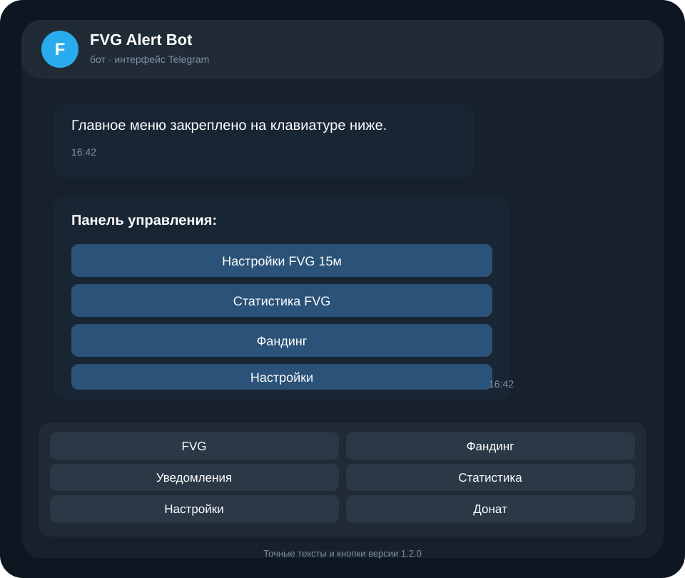
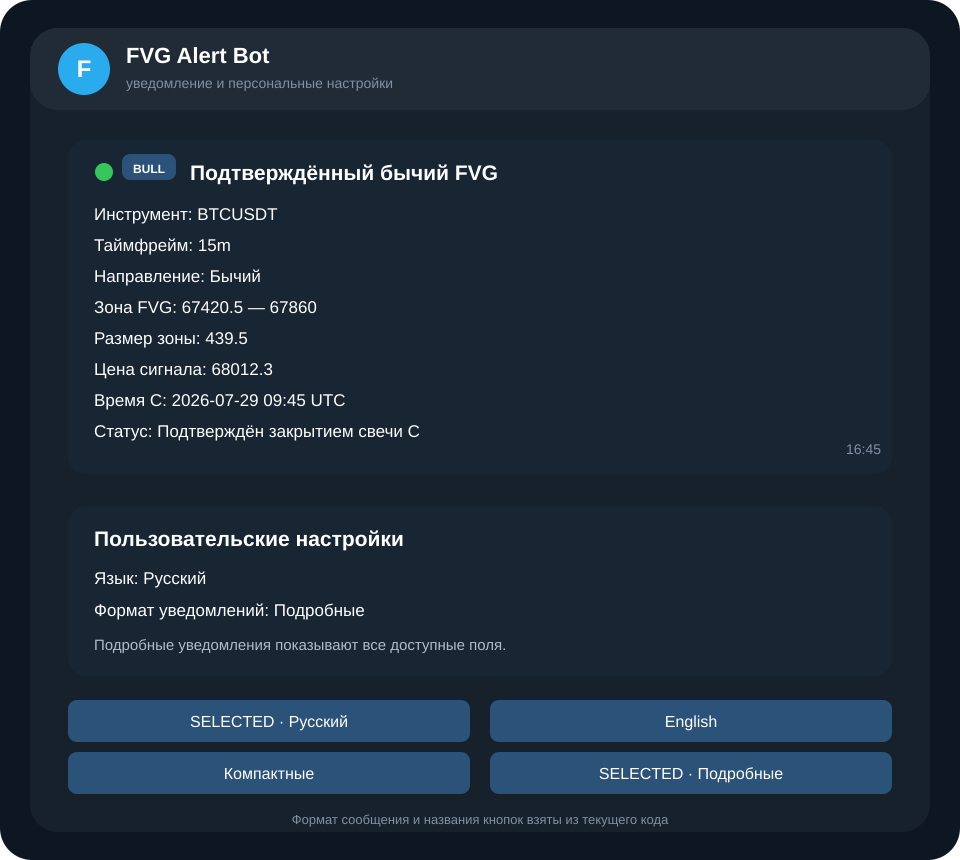
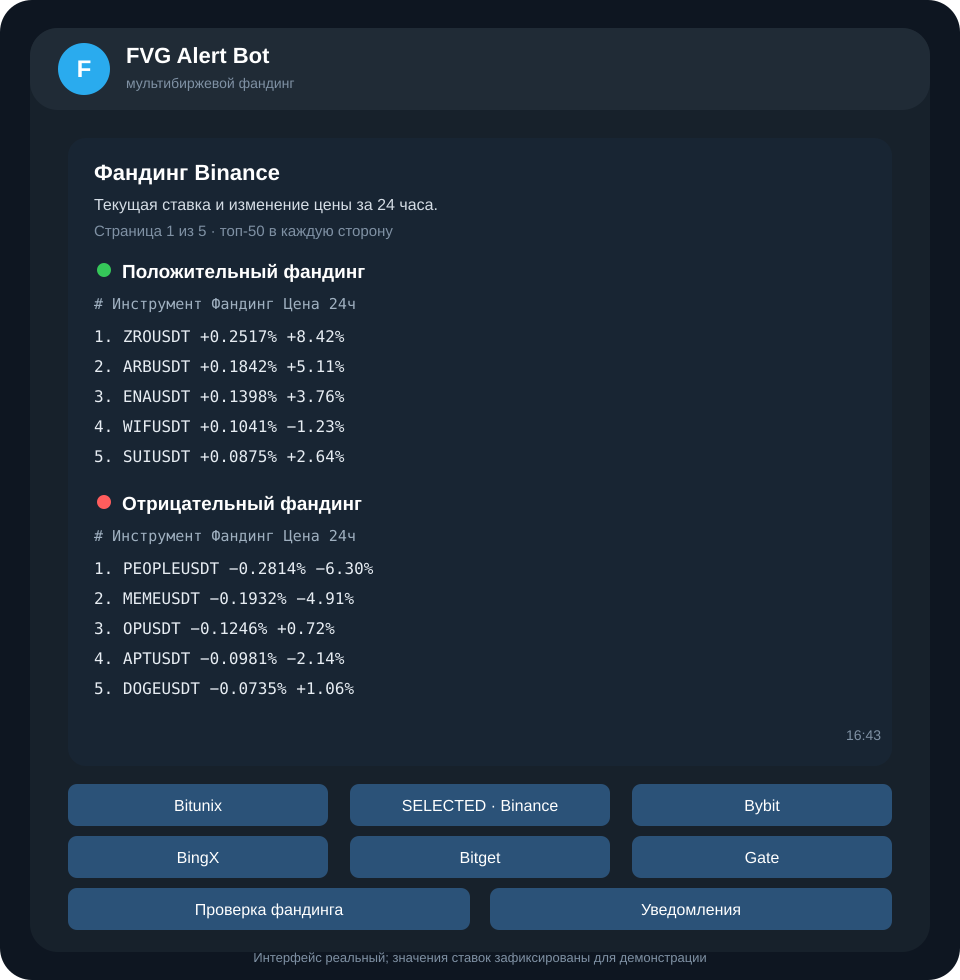

# FVG Alert Bot


Telegram-бот для мониторинга **Fair Value Gap (FVG)** на Bitunix и ставок фандинга на нескольких фьючерсных биржах. Бот собирает рыночные данные, применяет персональные фильтры, отправляет уведомления и показывает статистику прямо в Telegram.

Бот **не открывает сделки**, не управляет средствами пользователя и не является финансовой рекомендацией.

Актуальный стабильный релиз: **1.2.0**.

## Интерфейс программы

<p align="center">
  
  
</p>

<p align="center">
  
</p>

Изображения собраны из фактических текстов, кнопок и форматов сообщений текущей версии. Значения цен и ставок на иллюстрациях зафиксированы как демонстрационные, чтобы README не менялся вместе с рынком.

## Что умеет бот

### FVG

- предварительные FVG-уведомления в точке T−3;
- подтверждённые FVG на 15-минутном таймфрейме;
- отдельное включение бычьих и медвежьих сигналов;
- персональный список инструментов;
- фильтры цены и размера зоны;
- автоматическое включение подтверждённых FVG для `BTCUSDT` при первом `/start`;
- WebSocket Bitunix как основной источник данных;
- REST recovery, stale-watchdog и process watchdog;
- постоянная SQLite/WAL-очередь доставки с повторными попытками.

### Мультибиржевой фандинг

Поддерживаются:

- Bitunix;
- Binance;
- Bybit;
- BingX;
- Bitget;
- Gate.

Бот показывает топ положительных и отрицательных ставок, проверяет отдельный инструмент сразу по всем площадкам и позволяет настроить персональные уведомления:

- частота от `15` до `2880` минут с шагом `15` минут;
- минимальный абсолютный процент;
- положительное, отрицательное или оба направления;
- одна или несколько бирж;
- включение и выключение рассылки.

Общий снимок всех подключённых бирж обновляется на границах `:00`, `:15`, `:30` и `:45` UTC и используется для всех пользователей. В `funding_snapshot_history` сохраняются только три последних сжатых снимка.

### Telegram-интерфейс

После `/start` бот закрепляет постоянное нижнее меню:

- `📉 FVG`;
- `💸 Фандинг`;
- `🔔 Уведомления`;
- `📊 Статистика`;
- `⚙️ Настройки`;
- `❤️ Донат`.

Для каждого Telegram ID отдельно сохраняются:

- русский или английский язык;
- компактный или подробный формат уведомлений;
- FVG-фильтры;
- настройки funding alerts;
- выбранные биржи.

### Админ-панель

Команда `/admin` доступна только ID из `ADMIN_TELEGRAM_IDS`. Панель позволяет:

- переключать публичный и приватный режим;
- просматривать allowlist;
- проверять WebSocket и REST recovery;
- видеть outbox, доставки и ошибки;
- выполнять `PRAGMA quick_check` SQLite-баз;
- смотреть память, load average и свободное место;
- создавать ручной backup;
- проверять VERSION, BUILD_COMMIT и Python;
- подтверждённо перезапускать процесс через systemd.

Административные права проверяются заново при каждом callback.

## Архитектура и надёжность

- один общий WebSocket Bitunix для активных FVG-инструментов;
- один общий funding-снимок на биржу вместо копии рынка для каждого пользователя;
- SQLite/WAL для событий, доставок, outbox, funding-state и health-метрик;
- ограничение истории и регулярные checkpoint/vacuum;
- атомарная VDS-установка;
- автоматический rollback при неудачном запуске;
- ежедневные согласованные backup;
- health-метрики, watchdog и recovery-задачи.

Подробности:

- [`docs/RELEASE_1.2.0.md`](docs/RELEASE_1.2.0.md);
- [`docs/MULTI_EXCHANGE_FUNDING.md`](docs/MULTI_EXCHANGE_FUNDING.md);
- [`docs/VDS_DEPLOYMENT.md`](docs/VDS_DEPLOYMENT.md).

## Локальный запуск

Создайте `.env` рядом с `bot.py`:

```env
TELEGRAM_TOKEN=токен_от_BotFather
ADMIN_TELEGRAM_IDS=123456789
ALLOWED_TELEGRAM_IDS=123456789
PUBLIC_ACCESS_ENABLED=false
```

```bash
python3 -m venv .venv
.venv/bin/python -m pip install --upgrade pip
.venv/bin/python -m pip install -r requirements.txt
.venv/bin/python bot.py
```

API-ключи бирж для FVG и текущих funding-ставок не требуются.

## Первая установка на Ubuntu/Debian VDS

Поддерживаются Ubuntu 22.04/24.04 и Debian 12. Требуется не менее 1 ГБ свободного места на файловой системе `/opt` и 5000 inode.

```bash
ssh root@IP_АДРЕС_СЕРВЕРА
apt update && apt install -y git
git clone https://github.com/MishkaStrategy/TB.git /root/TB
cd /root/TB
git checkout main
test "$(cat VERSION)" = "1.2.0"
FVG_INSTALL_MIN_FREE_MB=1024 bash scripts/install_vds.sh
```

Установщик собирает staging-релиз и выполняет unit-тесты до остановки работающего процесса. Затем он создаёт backup, атомарно переключает релиз и автоматически возвращает предыдущую версию при ошибке запуска.

## Обновление существующего VDS до 1.2.0

Production-обновление рекомендуется выполнять по проверенному тегу, а не по движущемуся `main`:

```bash
ssh root@IP_АДРЕС_СЕРВЕРА
cd /root/TB
git fetch origin --tags --prune
git checkout main
git pull --ff-only origin main
TARGET_REF=v1.2.0 EXPECTED_VERSION=1.2.0 bash scripts/update_vds.sh
```

При необходимости можно дополнительно закрепить полный или сокращённый SHA:

```bash
TARGET_REF=v1.2.0 \
EXPECTED_VERSION=1.2.0 \
EXPECTED_COMMIT=ПРОВЕРЕННЫЙ_SHA \
  bash scripts/update_vds.sh
```

`scripts/update_vds.sh`:

1. проверяет root, чистоту checkout и существующую установку;
2. получает remote branch или tag из `TARGET_REF`;
3. проверяет `VERSION` и опциональный `EXPECTED_COMMIT`;
4. создаёт согласованный pre-update backup runtime-state;
5. запускает атомарный установщик с запасом не менее 1 ГБ;
6. проверяет systemd, версию и ссылку на runtime-state;
7. выполняет `PRAGMA quick_check` обеих SQLite-баз;
8. записывает Git SHA в `/opt/fvg-alert-bot/BUILD_COMMIT`.

Сохраняются `/etc/fvg-alert-bot.env`, `/var/lib/fvg-alert-bot` и пользовательские настройки. Повторно вводить токен и Telegram ID не требуется.

## Проверка после обновления

```bash
cat /opt/fvg-alert-bot/VERSION
cat /opt/fvg-alert-bot/BUILD_COMMIT
systemctl is-active fvg-alert-bot
systemctl is-enabled fvg-alert-bot
systemctl status fvg-alert-bot --no-pager --full
journalctl -u fvg-alert-bot -n 100 --no-pager
ls -lah /var/backups/fvg-alert-bot
```

Ожидается:

```text
1.2.0
active
enabled
```

Проверка ограниченной истории funding на VDS:

```bash
sqlite3 /var/lib/fvg-alert-bot/funding_alerts.sqlite3 \
  "SELECT captured_at, exchange_count, rate_count, compressed_bytes FROM funding_snapshot_history ORDER BY captured_at DESC;"
```

В результате должно быть не больше трёх строк.

В Telegram проверьте `/start`, `/menu`, `/funding`, `/admin` и `/donate`, переключение RU/EN, оба формата уведомлений и интервалы `15`, `45 мин`, `1ч`, `1,5ч`.

## Production-настройки

Основной файл:

```bash
nano /etc/fvg-alert-bot.env
```

Защитные лимиты:

```env
MAX_ACTIVE_SYMBOLS=100
MAX_SYMBOLS_PER_USER=20
FVG_DELIVERY_QUEUE_SIZE=1000
HEALTH_WRITE_INTERVAL_SECONDS=30
BITUNIX_REQUESTS_PER_SECOND=8
HEALTH_ALERT_INTERVAL_SECONDS=60
HEALTH_ALERT_STALE_WS_SECONDS=180
HEALTH_ALERT_OUTBOX_THRESHOLD=100
HEALTH_ALERT_COOLDOWN_SECONDS=1800
```

После ручного изменения:

```bash
chown root:fvgbot /etc/fvg-alert-bot.env
chmod 640 /etc/fvg-alert-bot.env
systemctl restart fvg-alert-bot
```

## Файлы на VDS

| Назначение | Путь |
|---|---|
| Активный релиз | `/opt/fvg-alert-bot` |
| Предыдущий релиз | `/opt/fvg-alert-bot.previous` |
| Runtime-state и SQLite | `/var/lib/fvg-alert-bot` |
| Секреты и production-настройки | `/etc/fvg-alert-bot.env` |
| Резервные копии | `/var/backups/fvg-alert-bot` |
| systemd units | `/etc/systemd/system/fvg-alert-bot*` |

Код и virtualenv принадлежат `root`. Процесс `fvgbot` записывает данные только в `/var/lib/fvg-alert-bot`.

## Backup и rollback

Ежедневный архив содержит JSON-state и согласованные SQLite-снимки обеих баз. Live WAL/SHM и каталог `.manual_backups` в архив не копируются.

```bash
systemctl list-timers fvg-alert-bot-backup.timer
systemctl start fvg-alert-bot-backup.service
journalctl -u fvg-alert-bot-backup.service -n 100 --no-pager
ls -lah /var/backups/fvg-alert-bot
```

Установщик хранит предыдущий релиз в `/opt/fvg-alert-bot.previous`. Подробные процедуры: [`docs/VDS_DEPLOYMENT.md`](docs/VDS_DEPLOYMENT.md).

## Диагностика

```bash
journalctl -u fvg-alert-bot -n 200 --no-pager
systemctl show fvg-alert-bot \
  -p NRestarts -p ExecMainStatus -p Result -p MemoryCurrent
df -h / /tmp /opt
df -ih / /tmp /opt
getent hosts api.telegram.org
getent hosts fapi.bitunix.com
getent hosts fapi.binance.com
getent hosts api.bybit.com
getent hosts open-api.bingx.com
getent hosts api.bitget.com
getent hosts api.gateio.ws
```

Telegram `Conflict` означает, что тот же токен используется другим polling-процессом.

## Команды

- `/menu` — открыть меню;
- `/fvg_alert on|off` — подтверждённые FVG;
- `/fvg_pre_alert on|off` — пред-FVG T−3;
- `/fvg_symbol add ETHUSDT` — добавить инструмент;
- `/fvg_symbol remove ETHUSDT` — удалить инструмент;
- `/fvg_price BTCUSDT 50000 90000 both` — ценовой фильтр;
- `/fvg_size` — фильтр размера зоны;
- `/fvg_stats` — статистика FVG;
- `/funding` — мультибиржевой рейтинг и funding alerts;
- `/admin` — админ-панель;
- `/donate` — поддержать проект.

## Проверки

```bash
PUBLIC_ACCESS_ENABLED=true \
MPLCONFIGDIR=/tmp/trading-assistant-mpl \
  .venv/bin/python -m unittest discover -s tests -v
```

CI включает GitHub-hosted полный release-аудит: shell validation, dependency audit, компиляцию, полный unit suite, bounded soak и проверку production systemd units. Отдельно проверяются 15-минутный scheduler, миграция старых интервалов, ограниченная история SQLite и политика capability labels.

После публикации workflow создаёт тег `v1.2.0`, GitHub Release, исходный архив `fvg-alert-bot-1.2.0.tar.gz` и SHA-256 checksum.
